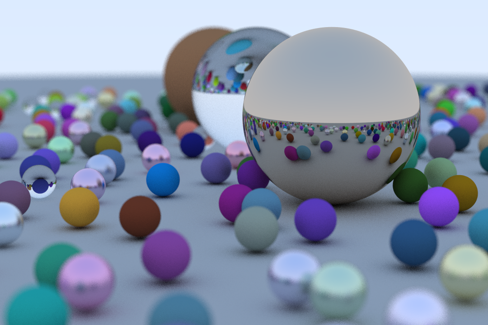

# zig-raytracing
Implementation of a very simple raytracing renderer following the great guide in
[Raytracing in One Weekend](http://in1weekend.blogspot.com/2016/01/ray-tracing-in-one-weekend.html).



## Installation
This project was developed on Zig 0.8. Zig is a fast moving language, newer versions
might not be able to compile it.

```bash
git clone https://github.com/pedromsilvapt/zig-raytracing.git
cd zig-raytracing
zig build -Drelease-fast
```

## Usage
The compiled application can be ran directly from the command line.
```bash
./zig-out/bin/raytracing
```
